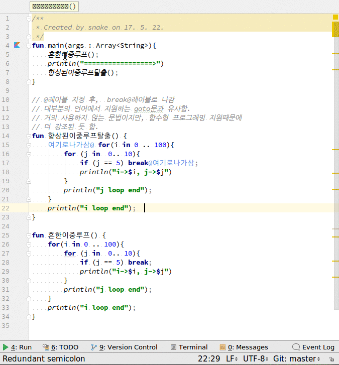

# label로 jump
1. goto 문과 유사한 기능.
2. @레이블 지정 후,  break@레이블로 나감
3. 함수형 프로그래밍을 할 경우, 유용할 지도...

## 전체소스
~~~kotlin
fun main(args : Array<String>){
    흔한이중루프();
    println("=================>")
    향상된이중루프탈출();
}

// @레이블 지정 후,  break@레이블로 나감
// 대부분의 언어에서 지원하는 goto문과 유사함.
// 거의 사용하지 않는 문법이지만, 함수형 프로그래밍 지원때문에
// 더 강조된 듯 함.
fun 향상된이중루프탈출() {
    여기로나가삼@ for(i in 0 .. 100){
        for (j in  0.. 10){
            if (j == 5) break@여기로나가삼;
            println("i->$i, j->$j")
        }
        println("j loop end");
    }
    println("i loop end");
}

fun 흔한이중루프() {
    for(i in 0 .. 100){
        for (j in  0.. 10){
            if (j == 5) break;
            println("i->$i, j->$j")
        }
        println("j loop end");
    }
    println("i loop end");
}
~~~

