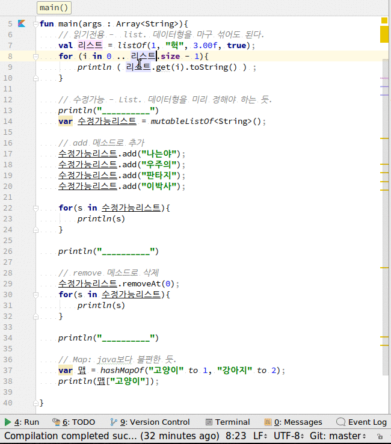

# collections
1. 읽기전용 List -> listOf. 항목의 데이터형을 혼합해도 됨.
2. 수정가능 List -> mutableListOf.  제너릭( <> )으로 데이터형을 반드시 선언. 각종 메소드(add, remove,...)
3. Map은 hashMapOf(키 to 값, ... ) 형식

## 전체소스
~~~kotlin
fun main(args : Array<String>){
    // 읽기전용 -  list. 데이터형을 마구 섞어도 된다.
    val 리스트 = listOf(1, "헉", 3.00f, true);
    for (i in 0 .. 리스트.size - 1){
        println ( 리스트.get(i).toString() ) ;
    }

    // 수정가능 - List. 데이터형을 미리 정해야 하는 듯.
    println("__________")
    var 수정가능리스트 = mutableListOf<String>();

    // add 메소드로 추가
    수정가능리스트.add("나는야");
    수정가능리스트.add("우주의");
    수정가능리스트.add("판타지");
    수정가능리스트.add("이박사");

    for(s in 수정가능리스트){
        println(s)
    }

    println("__________")

    // remove 메소드로 삭제
    수정가능리스트.removeAt(0);
    for(s in 수정가능리스트){
        println(s)
    }

    println("__________")

    // Map: java보다 불편한 듯.
    var 맵 = hashMapOf("고양이" to 1, "강아지" to 2);
    println(맵["고양이"]);

}
~~~

