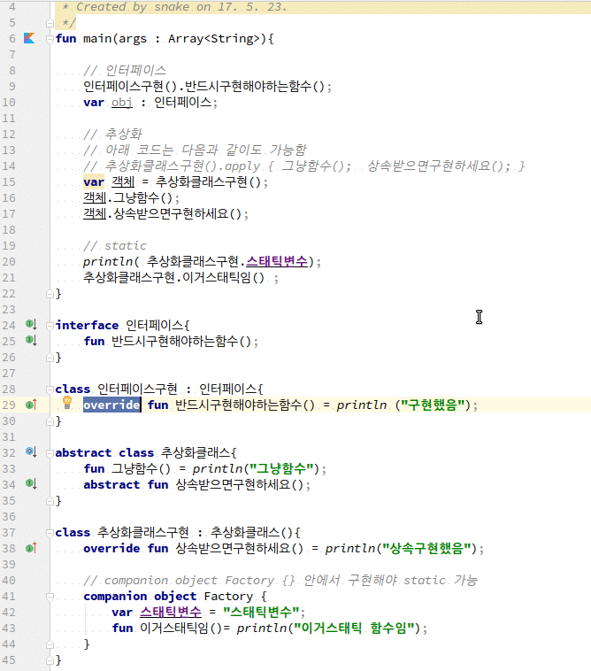

# interface, abstract, static
1. interface는
~~~
interface 이름 {}
~~~
으로 정의한다. 오버라이드하기 위해 open이나 기타 지시자로 정의할 필요가 없다.

2. abstract class는 구현상속할 메소드도 abstract로 정의해야 한다.
~~~
// 정의
abstract class 추상화클래스{
    abstract fun 메소드();
}

...

// 구현상속
class 추상화클래스구현 : 추상화클래스(){
    override fun 메소드() = println("상속구현했음");
}
~~~

3. static을 사용하려면 클래스 내에 **companion object Factory**{}를 만들고 그 안에 메소드나
멤버필드를 정의한다.

## 전체소스
~~~kotlin
fun main(args : Array<String>){

    // 인터페이스
    인터페이스구현().반드시구현해야하는함수();
    var obj : 인터페이스;

    // 추상화
    // 아래 코드는 다음과 같이도 가능함
    // 추상화클래스구현().apply { 그냥함수();  상속받으면구현하세요(); }
    var 객체 = 추상화클래스구현();
    객체.그냥함수();
    객체.상속받으면구현하세요();

    // static
    println( 추상화클래스구현.스태틱변수);
    추상화클래스구현.이거스태틱임() ;
}

interface 인터페이스{
    fun 반드시구현해야하는함수();
}

class 인터페이스구현 : 인터페이스{
    override fun 반드시구현해야하는함수() = println ("구현했음");
}

abstract class 추상화클래스{
    fun 그냥함수() = println("그냥함수");
    abstract fun 상속받으면구현하세요();
}

class 추상화클래스구현 : 추상화클래스(){
    override fun 상속받으면구현하세요() = println("상속구현했음");

    // companion object Factory {} 안에서 구현해야 static 가능
    companion object Factory {
        var 스태틱변수 = "스태틱변수";
        fun 이거스태틱임()= println("이거스태틱 함수임");
    }
}
~~~

