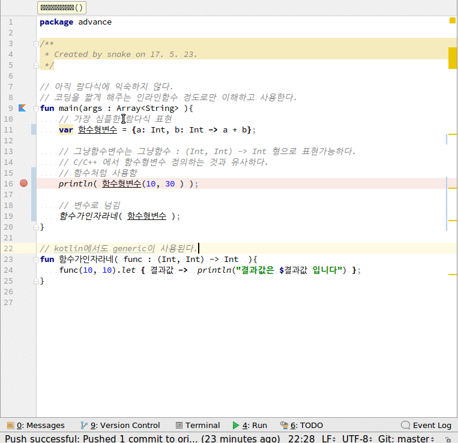

# 람다식
1. 식별자 없이 실행 가능한 함수 표현식. **가독성을 위해** 코드를 줄이는 것.
2. 요즘 언어의 유행. 특히 자바에서는 필요한 요소였음(***공포의 anonymous object***). java8부터 지원.
3. 함수형 프로그래밍에서는 자주사용됨.
4. 일반적인 형식은..
~~~
{ 변수정의 -> 함수구현 }
~~~
5. 함수형 ***변수*** 선언
~~~
var 이름 = { 변수정의 -> 함수구현 };
~~~
6. 함수형 변수 ***형*** 선언. C/C++ 함수포인터와 유사함.
~~~
이름 : (변수정의)->리턴형;
~~~

## 전체소스
~~~kotlin
fun main(args : Array<String> ){
    // 가장 심플한 람다식 표현
    var 그냥함수변수 = {a: Int, b: Int -> a + b};

    // 그냥함수변수는 그냥함수 : (Int, Int) -> Int 형으로 표현가능하다.
    // C/C++ 에서 함수형변수 정의하는 것과 유사하다.
    함수가인자라네( 그냥함수변수 );
}

// kotlin에서도 generic이 사용된다.
fun 함수가인자라네( func : (Int, Int) -> Int  ){
    func(10, 10).let { 결과값 ->  println("결과값은 $결과값 입니다") };
}
~~~

