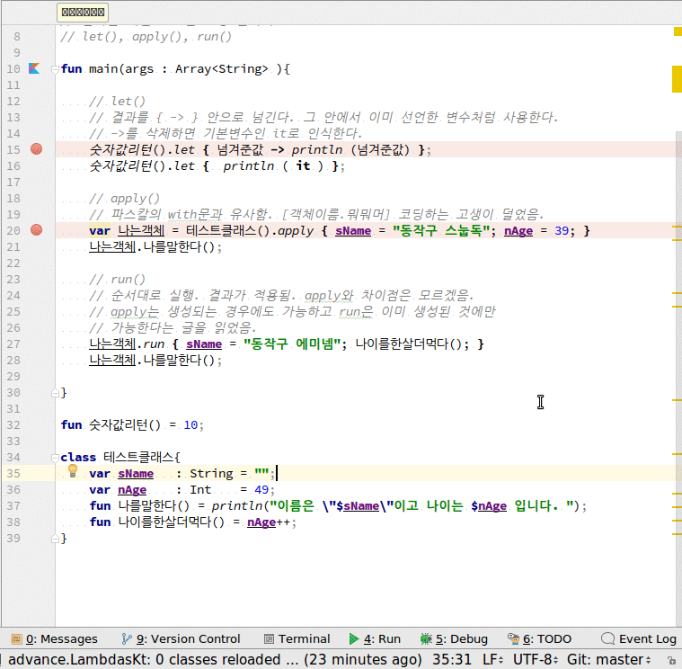

# 중요함수(let, apply, run)
1. let(). 다음,  **결과를 {}안에 넘긴다** ->를 사용할 경우 변수명 지정이 가능하다.
2. apply().다음, 객체를(생성과 동시)  **결과를 {}안에 넘긴다**. 파스칼의 with문과 유사. {}안에서 메소드도 실행가능하다.
3. run(). apply()와 유사하지만 이미 생성된 객체에서만 사용가능.

## 전체소스
~~~kotlin

fun main(args : Array<String> ){

    // let()
    // 결과를 { -> } 안으로 넘긴다. 그 안에서 이미 선언한 변수처럼 사용한다.
    // ->를 삭제하면 기본변수인 it로 인식한다.
    숫자값리턴().let { 넘겨준값 -> println (넘겨준값) };
    숫자값리턴().let {  println ( it ) };

    // apply()
    // 파스칼의 with문과 유사함. [객체이름.뭐뭐머] 코딩하는 고생이 덜었음.
    var 나는객체 = 테스트클래스().apply { sName = "동작구 스눕독"; nAge = 39; }
    나는객체.나를말한다();

    // run()
    // 순서대로 실행. 결과가 적용됨. apply와 차이점은 모르겠음.
    // apply는 생성되는 경우에도 가능하고 run은 이미 생성된 것에만
    // 가능한다는 글을 읽었음.
    나는객체.run { sName = "동작구 에미넴"; 나이를한살더먹다(); }
    나는객체.나를말한다();

}

fun 숫자값리턴() = 10;

class 테스트클래스{
    var sName   : String = "";
    var nAge    : Int    = 49;
    fun 나를말한다() = println("이름은 \"$sName\"이고 나이는 $nAge 입니다. ");
    fun 나이를한살더먹다() = nAge++;
}
~~~

