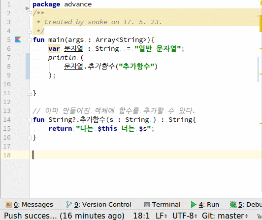

# 확장함수
1. kotlin에서는 소스를 수정할 수 없는 import된 클래스(예로 **String**)에 함수를 확장하여 추가할 수 있다.

## 전체소스
~~~kotlin
fun main(args : Array<String>){
    var 문자열 : String  = "일반 문자열";
    println (
        문자열.추가함수("추가함수")
    );

}

// 이미 만들어진 객체에 함수를 추가할 수 있다.
fun String?.추가함수(s : String ) : String{
    return "나는 $this 너는 $s";
}

~~~

