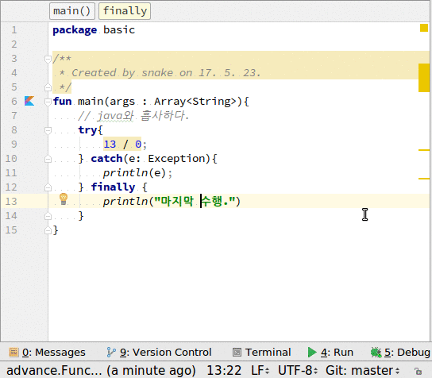

# 예외처리
1. 예외처리인 try/catch문은 자바와 많이 비슷하다.
2. 예외객체가 java의 객체와 동일하다.
~~~
    try{
    } catch(e: 각종Exception){
    } finally {
    }
~~~

## 전체소스
~~~kotlin
fun main(args : Array<String>){
    // java와 흡사하다.
    try{
        13 / 0;
    } catch(e: Exception){
        println(e);
    } finally {
        println("마지막 수행.")
    }
}
~~~

