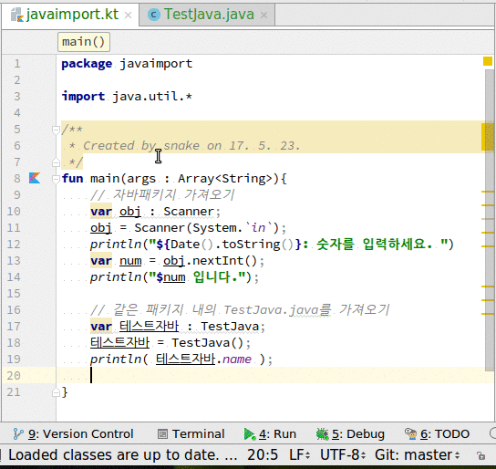

# java 사용
1. java 클래스를 편리하게 가져다 사용할 수 있다.

## 전체소스 - kotlin
~~~kotlin
fun main(args : Array<String>){
    // 자바패키지 가져오기
    var obj : Scanner;
    obj = Scanner(System.`in`);
    println("${Date().toString()}: 숫자를 입력하세요. ")
    var num = obj.nextInt();
    println("$num 입니다.");

    // 같은 패키지 내의 TestJava.java를 가져오기
    var 테스트자바 : TestJava;
    테스트자바 = TestJava();
    println( 테스트자바.name );

}
~~~

## 전체소스 - java
~~~java
public class TestJava {
    String getName(){
        return this.toString();
    };
}
~~~

