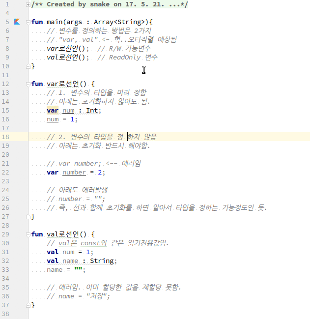

# Kotlin에서 변수선언 및 대입
1. kotlin에서는 변수사용하는 방법이 독특하다.
var로 변수를 선언하지만, 초기화를 하는 경우는 형을 생략가능하다.
반면 초기화를 하지 않으면 반드시 형을 선언해야 한다. 선언문법이 왠지 Pascal스럽다.
2. var와 val의 사용법을 구분해야 한다. var는 일반변수처럼 읽고 쓰기가 가능하다. 그러나 val은 오로지 readonly이다.
 마치 const와 같다.

## 전체소스
~~~kotlin
fun main(args : Array<String>){
    // 변수를 정의하는 방법은 2가지
    // "var, val" <- 헉..오타작렬 예상됨
    var로선언();  // R/W 가능변수
    val로선언();  // ReadOnly 변수
}

fun var로선언() {
    // 1. 변수의 타입을 미리 정함
    // 아래는 초기화하지 않아도 됨.
    var num : Int;
    num = 1;

    // 2. 변수의 타입을 정하지 않음
    // 아래는 초기화 반드시 해야함.

    // var number; <-- 에러임
    var number = 2;

    // 아래도 에러발생
    // number = "";
    // 즉, 선과 함께 초기화를 하면 알아서 타입을 정하는 기능정도인 듯.
}

fun val로선언() {
    // val은 const와 같은 읽기전용값임.
    val num = 1;
    val name : String;
    name = "";

    // 에러임. 이미 할당한 값을 재할당 못함.
    //name = "저장";
}
~~~
