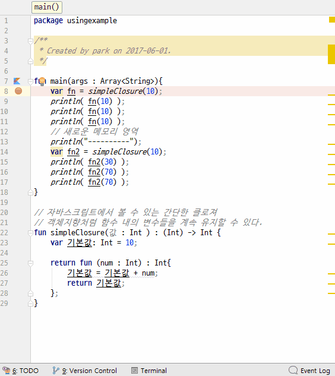

# closure
1. 클로저의 정의는 독립적인 (자유) 변수 (지역적으로 사용되지만, 둘러싼 범위 안에서 정의된 변수)를 참조하는 함수들이다. 다른 말로 하면, 이 함수들은 그들이 생성된 환경을 '기억'한다.
2. 클로저는 함수안에 정의된 변수 또는 함수를 메모리에 그대로 가지고 있다. 마치 클래스와 객체와 같이 행동한다.
3. 클로저는 함수를 실행할 때마다 그 결과를 기억하고 있다.

## 전체소스 - kotlin
~~~kotlin
fun main(args : Array<String>){
    var fn = simpleClosure(10);
    println( fn(10) );
    println( fn(10) );
    println( fn(10) );
    // 새로운 메모리 영역
    println("----------");
    var fn2 = simpleClosure(10);
    println( fn2(30) );
    println( fn2(70) );
    println( fn2(70) );
}

// 자바스크립트에서 볼 수 있는 간단한 클로져
// 객체지향처럼 함수 내의 변수들을 계속 유지할 수 있다.
fun simpleClosure(값 : Int ) : (Int) -> Int {
    var 기본값: Int = 10;

    return fun (num : Int) : Int{
        기본값 = 기본값 + num;
        return 기본값;
    };
}
~~~

