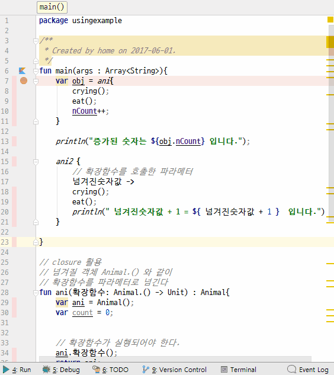

# closure
1. kotlin에서 클로저를 사용하여 객체를 넘길 때에는 확장함수를 사용한다.
2. 확장함수는 어떤 형식이 되던 관계없다. 호출만 되면 된다.
3. 확장함수를 실행함과 동시에 같은 메모리 공간을 공유할 수 있다.
4. 확장함수가 실행되면 클로저를 생성하는 함수명 { 파라메터 -> 원하는 코딩}으로 진입하여 명령을 수행한다.
## 전체소스 - kotlin
~~~kotlin
fun main(args : Array<String>){
    var obj = ani{
        crying();
        eat();
        nCount++;
    }

    println("증가된 숫자는 ${obj.nCount} 입니다.");

    ani2 {
        // 확장함수를 호출한 파라메터
        넘겨진숫자값 ->
        crying();
        eat();
        println(" 넘겨진숫자값 + 1 = ${ 넘겨진숫자값 + 1 }  입니다.")
    }

}

// closure 활용
// 넘겨질 객체 Animal.() 와 같이
// 확장함수를 파라메터로 넘긴다
fun ani(확장함수: Animal.() -> Unit) : Animal{
    var ani = Animal();
    var count = 0;

    // 확장함수가 실행되어야 한다.
    ani.확장함수();
    return ani;
}

// 넘겨질 객체 Animal.() 와 같이
// 확장함수를 파라메터로 넘긴다.
// 1개의 숫자를 넘긴다.
fun ani2(확장함수: Animal.(Int) -> Unit) : Animal{
    var ani = Animal();

    // 확장함수가 실행되어야 한다. 숫자를 넘겼다.
    ani.확장함수(3);
    return ani;
}

class Animal{
    open var nCount = 0;
    fun crying() = println("$this>> 아흥");
    fun eat()    = println("$this>> 우걱우걱");
}
~~~

