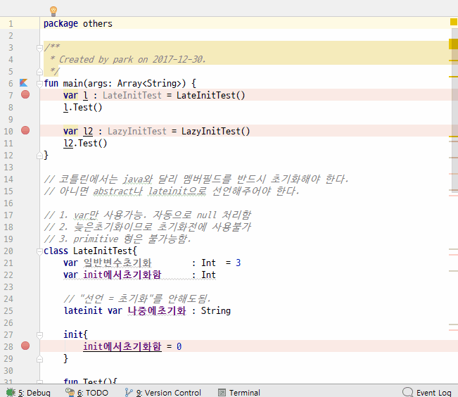

# lateinit
1. lateinit 예약어를 사용하면 클래스에서 변수 : 형으로 선언가능하다. 나중에 초기화 할 수 있음.
2. var만 사용가능. 자동으로 null 처리함
3. primitive 형은 불가능함

# lazy
1. 코드 어디선가 사용할 때, 1회 초기화 실행된다(안드로이드에서 위젯 초기화시 유리).
2. val로 선언
3. primitive 형도 가능함.
4. 초기화 실행 시, 일련의 코딩도 가능하다.

## 전체소스 - kotlin
~~~kotlin

fun main(args: Array<String>) {
    var l : LateInitTest = LateInitTest()
    l.Test()

    var l2 : LazyInitTest = LazyInitTest()
    l2.Test()
}

// 코틀린에서는 java와 달리 멤버필드를 반드시 초기화해야 한다.
// 아니면 abstract나 lateinit으로 선언해주어야 한다.

// 1. var만 사용가능. 자동으로 null 처리함
// 2. 늦은초기화이므로 초기화전에 사용불가
// 3. primitive 형은 불가능함.
class LateInitTest{
    var 일반변수초기화        : Int  = 3
    var init에서초기화함      : Int

    // "선언 = 초기화"를 안해도됨.
    lateinit var 나중에초기화 : String

    init{
        init에서초기화함 = 0
    }

    fun Test(){
        this.나중에초기화 = "lateinit 초기화"
        println(this.나중에초기화)
    }

}

// 1. val로 선언
// 2. 사용하는 시점에서 초기화가 1회 발생
// 3. primitive 형도 가능
class LazyInitTest{
    val lazy1 : String by lazy{
        "lazyinit 초기화"
    }

    val lazy2 : Int by lazy{
        println("1회 초기화시 몇줄코딩도 가능")
        for(i in (0..5)){
            println (i )
        }

        // 값
        333
    }

    fun Test(){
        println(lazy1)
        println(lazy2)
        println(lazy2)
    }
}

~~~

