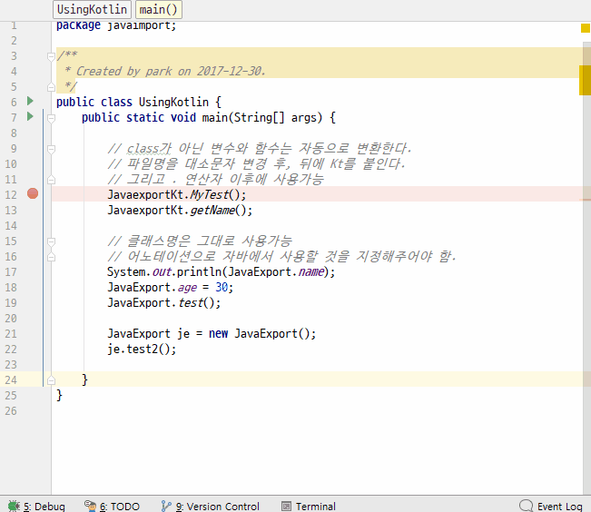

# kotlin 함수와 클래스를 java에서...
1. class가 아닌 변수와 함수는 자동으로 변환한다.
2. 파일명을 대소문자 변경 후, 뒤에 Kt를 붙인다.
3. 일반변수는 getXXX() 형식으로 변환됨(읽기만됨).
4. @와 같은 어노테이션을 이용하면 자바에서도 편하게 사용가능함.
5. @JvmField은 변수로 선언
5. @JvmStatic은 static 함수로 선언

## 전체소스 - kotlin
~~~kotlin

class JavaExport{
    companion object {
        // 반드시 const로 선언
        const val name = "class name"

        @JvmField var age = 32
        @JvmStatic fun test(){
            println("나이는 $age 입니다.")
        }

    }

    // java에서는 메소드처럼 사용됨
    // @JvmField var normal_variable로 하면 java에서도 멤버변수처럼 사용가능
    var normal_variable = "밖에서 액세스가능"

    fun test2(){
        println("일반메소드")
    }
}

// Kotlin 일반함수와 변수
val name = "name"
fun MyTest(){}
~~~

## 전체소스 - java
~~~java

public class UsingKotlin {
    public static void main(String[] args) {

        // class가 아닌 변수와 함수는 자동으로 변환한다.
        // 파일명을 대소문자 변경 후, 뒤에 Kt를 붙인다.
        // 그리고 . 연산자 이후에 사용가능
        JavaexportKt.MyTest();
        JavaexportKt.getName();

        // 클래스명은 그대로 사용가능
        // 어노테이션으로 자바에서 사용할 것을 지정해주어야 함.
        System.out.println(JavaExport.name);
        JavaExport.age = 30;
        JavaExport.test();

        JavaExport je = new JavaExport();
        je.test2();

    }

~~~

