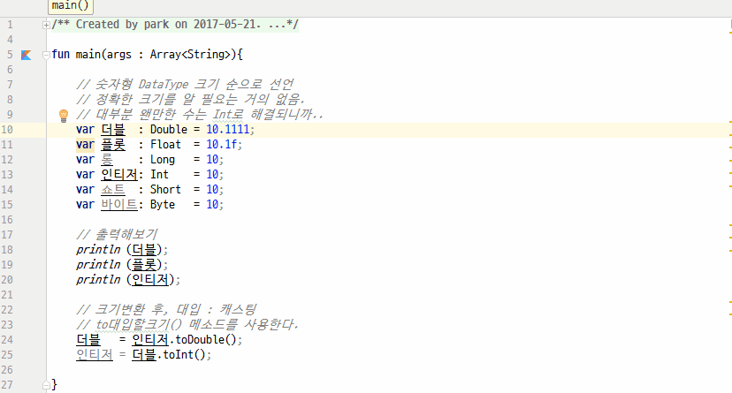

# 숫자형
1. kotlin에서는 숫자형 데이터타입으로 Double, Float, Long, Int, Short, Byte가 있다. 
2. 캐스팅(자료형변환)을 한다면 변수에 존재하는 to크기() 메소드를 사용해야 한다.

## 전체소스
~~~kotlin
fun main(args : Array<String>){

    // 숫자형 DataType 크기 순으로 선언
    // 정확한 크기를 알 필요는 거의 없음.
    // 대부분 왠만한 수는 Int로 해결되니까..
    var 더블  : Double = 10.1111;
    var 플롯  : Float  = 10.1f;
    var 롱    : Long   = 10;
    var 인티저: Int    = 10;
    var 쇼트  : Short  = 10;
    var 바이트: Byte   = 10;

    // 출력해보기
    println (더블);
    println (플롯);
    println (인티저);

    // 크기변환 후, 대입 : 캐스팅
    // to대입할크기() 메소드를 사용한다.
    더블   = 인티저.toDouble();
    인티저 = 더블.toInt();

}
~~~
