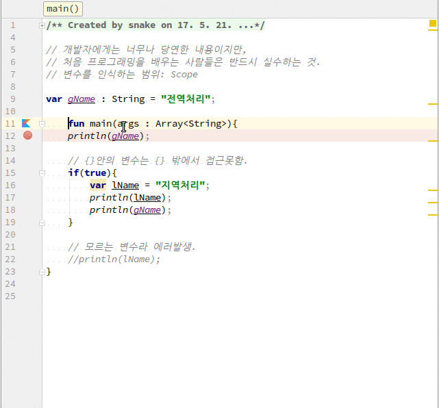

# Kotlin에서 변수의 scope
1. {}밖에서 먼저 선언한 변수는 {} 안에서 인식한다.
2. {}안의 변수는 {} 밖에서 액세스 못한다.
3. 개발자에게는 너무나 당연한 이야기이지만 처음 이해할 때는 힘들다.

## 전체소스
~~~kotlin
// 개발자에게는 너무나 당연한 내용이지만,
// 처음 프로그래밍을 배우는 사람들은 반드시 실수하는 것.
// 변수를 인식하는 범위: Scope

var gName : String = "전역처리";

fun main(args : Array<String>){
    println(gName);

    // {}안의 변수는 {} 밖에서 접근못함.
    if(true){
        var lName = "지역처리";
        println(lName);
        println(gName);
    }

    // 모르는 변수라 에러발생.
    //println(lName);
}

}
~~~
