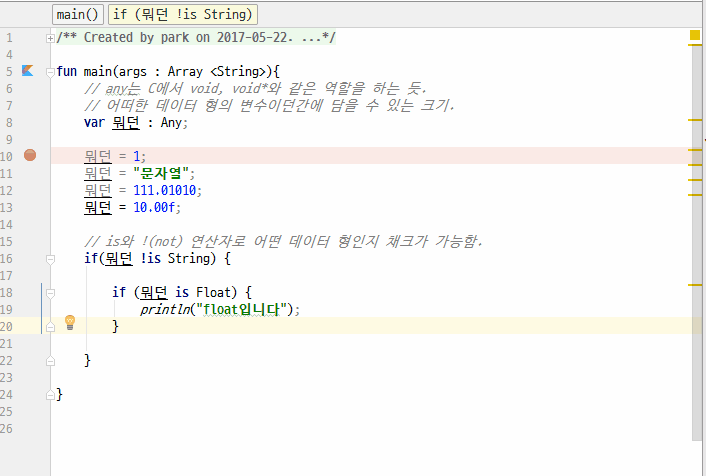

# any
1. any "무엇이던 담을 수 있는 데이터 형" - *C의 void 포인터*
2. is와 !(not) 연산자로 어떤 데이터 형인지 채크가 가능함.

## 전체소스
~~~kotlin

fun main(args : Array <String>){
    // any는 C에서 void*와 같은 역할을 하는 듯.
    // 어떠한 데이터 형의 변수이던간에 담을 수 있는 크기.
    var 뭐던 : Any;

    뭐던 = 1;
    뭐던 = "문자열";
    뭐던 = 111.01010;
    뭐던 = 10.00f;

    // is와 !(not) 연산자로 어떤 데이터 형인지 채크가 가능함.
    if(뭐던 !is String) {

        if (뭐던 is Float) {
            println("float입니다");
        }

    }

}

~~~

