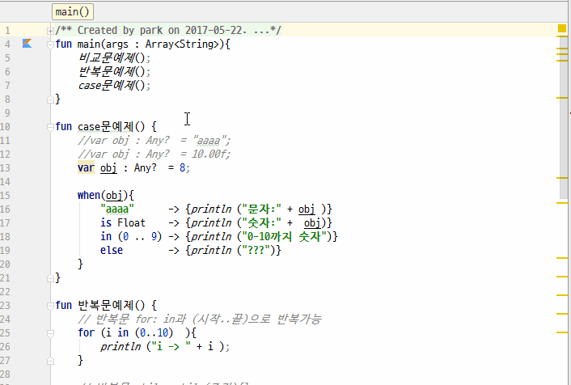

# 제어문
1. if문은 java와 유사하다. 단지 Any 타입이 쓰이며 in, is 등과 함께 사용되어 더 유연하게 사용된다.
2. 반복문은 for문은 **for(변수 in 배열 or 범위){}** 형식으로 사용된다.
3. 반복문은 while문은 **while(조건){}** 형식으로 사용된다.
4. case 문은 Any 타입과 사용되어 상당히 유연하다. **when(변수){조건 -> 실행; ..}** 형식으로 쓰인다.

## 전체소스
~~~kotlin
fun main(args : Array<String>){
    비교문예제();
    반복문예제();
    case문예제();
}

fun case문예제() {
    //var obj : Any?  = "aaaa";
    var obj : Any?  = 10.00f;
    //var obj : Any?  = 8;

    when(obj){
        "aaaa"      -> {println ("문자:" + obj )}
        is Float    -> {println ("숫자:" +  obj)}
        in (0 .. 9) -> {println ("0-10까지 숫자")}
        else        -> {println ("???")}
    }
}

fun 반복문예제() {
    // 반복문 for: in과 (시작..끝)으로 반복가능. ()는 생략가능
    for (i in (0..10)  ){
        println ("i -> " + i );
    }

    // 반복문 while: while(조건){}
    var i : Int = 0;
    while(i < 10){ i++; println ("$i 입니다."); }
}

fun 비교문예제() {
    // 비교문
    //var a : Any?  = "aaaa";
    //var a : Any?  = 10.00f;
    //var a : Any?  = 8;
    var a : Any?  = null;

    if (a == "aaaa"){              // ==를 이용한 값비교
        println ("문자:" + a );

    } else if( a is Float )  {     // is를 이용한 형비교
        println ("숫자:" +  a);

    } else if (a in (0..9) ){      // in을 이용한 범위비교
        println ("0-10까지 숫자");

    } else if (a == null ){
        println ("null!");
    }
}
~~~

