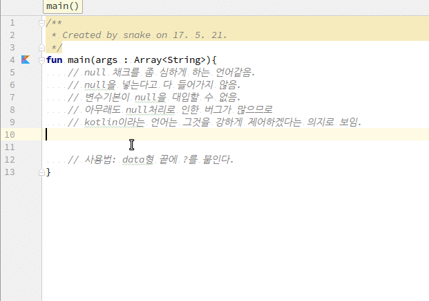

# Kotlin에서 변수에 null 대입
1. kotlin에서는 변수는 기본으로 null을 허용하지 않는다.
2. data type 뒤에 null이 가능하다는 ?를 지정해주어야 null을 사용할 수 있다.

## 전체소스
~~~kotlin
fun main(args : Array<String>){
    // null 채크를 좀 심하게 하는 언어같음.
    // null을 넣는다고 다 들어가지 않음.
    // 변수기본이 null을 대입할 수 없음.
    // 아무래도 null처리로 인한 버그가 많으므로
    // kotlin이라는 언어는 그것을 강하게 제어하겠다는 의지로 보임.

    var number : Int? = 10;
    number = null;

    // 사용법: data형 끝에 ?를 붙인다.
}
~~~
